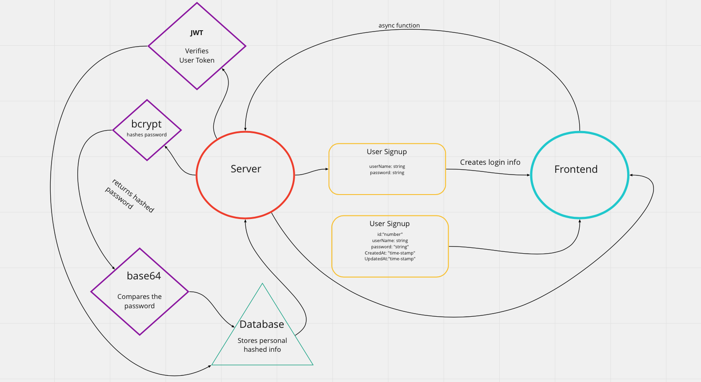

> # Basic Auth LAB - 07

## Deployment Test

### Author: Danny Castro

- tests report

- [front-end](https://dannys-basic-auth.herokuapp.com)

### Setup

`.env` **requirements**

- NODE_ENV
- DATABASE_URL
- SECRET

PORT - 3000

**Running the app**

npx nodemon

**Endpoint:** /signup or signin

Returns user

 {
  - **"id"**: 3,
  - **"username"**: "45",
  - **"password"**: "$2b$10$bFONmmi7Y8g33NyeesOhi.kNr1cF/8ydMaLe8p92q50OueFp.BFBi",
  - **"createdAt"**: "2022-07-31T20:56:34.973Z",
  - **"updatedAt"**: "2022-07-31T20:56:34.973Z"

}

**Tests**

Unit Tests: npm run test

**UML**

(Created with Miro)

